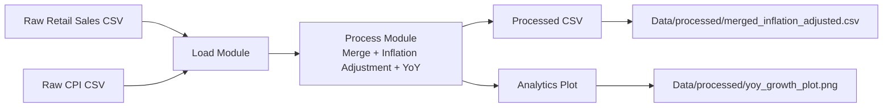

Voici la **version propre, formatée, prête à coller directement** dans ton README (mode *Edit → Paste*).
Aucun texte ajouté autour. Tu peux copier-coller tel quel :

---

# 🇺🇸 U.S. Economic Data Pipeline

## 🚀 Inflation-Adjusted Retail Sales Analysis

**Author: Mouhcine Riany — © 2025**

---

## 📌 Overview

This project implements a **fully-local ETL pipeline** that ingests U.S. economic datasets (Retail Sales & CPI), transforms them, adjusts sales for inflation, computes YoY growth, and generates analytical outputs.
It follows a **clean, modular, production-inspired architecture** used in real Data Engineering pipelines.

---

## 🗂️ Project Architecture

```
us-economic-data-pipeline/
│
├── data/
│   ├── raw/               <- Input CSVs
│   └── processed/         <- Output CSV + charts
│
├── src/
│   ├── load.py            <- Ingestion layer
│   ├── process.py         <- Transformation layer
│   └── main.py            <- Orchestrator
│
├── venv/
│
├── .gitignore
└── README.md
```

---

## 🧠 Pipeline Flow (ETL Diagram)



---

## ⚙️ Features

* ✔️ Retail Sales + CPI monthly ingestion
* ✔️ Date normalization
* ✔️ Inflation-adjusted retail sales
* ✔️ Year-over-year growth calculation
* ✔️ Automatic plot generation
* ✔️ Clean, modular ETL architecture
* ✔️ Ready for production extensions (Docker, Cloud, Airflow)

---

## 📊 Generated Outputs

### **1. Processed Dataset**

📁 `data/processed/merged_inflation_adjusted.csv`
Contains:

* month
* retail_sales
* cpi
* inflation_adjusted_sales
* yoy_growth_pct

### **2. Analytical Plot**

📈 `data/processed/yoy_growth_plot.png`
A clean visualization of YoY growth on inflation-adjusted sales.

---

## ▶️ Running the Pipeline

### 1. Activate virtual environment

```bash
source venv/bin/activate
```

### 2. Run the main ETL

```bash
python src/main.py
```

**Outputs are generated in:**
📁 `data/processed/`

---

## 🛠️ Technologies

| Category        | Tools                       |
| --------------- | --------------------------- |
| Language        | Python 3                    |
| ETL             | Custom modular architecture |
| Data Processing | Pandas                      |
| Visualization   | Matplotlib                  |
| Version Control | Git & GitHub                |

---

## 🎯 Goals of This Project

This project demonstrates real-world Data Engineering capabilities:

* ETL design & modularity
* Data cleaning & merging
* Price index normalization
* Economic data analytics
* Automated reporting workflow
* Software-engineered code structure

Ideal for:

* Portfolio building
* Data/ML Engineering interviews
* Demonstrating pipeline architecture mastery

---

## 🚀 Future Improvements

* FRED API integration
* Pipeline Dockerization
* CI/CD with GitHub Actions
* Airflow DAG version
* Add unit tests (pytest)
* Add a Streamlit dashboard

---

## 🤝 Contributing

Feel free to fork this repository and submit a pull request.

---

## 📝 License

© **2025 — Mouhcine Riany**
Open for educational and portfolio use.

---
